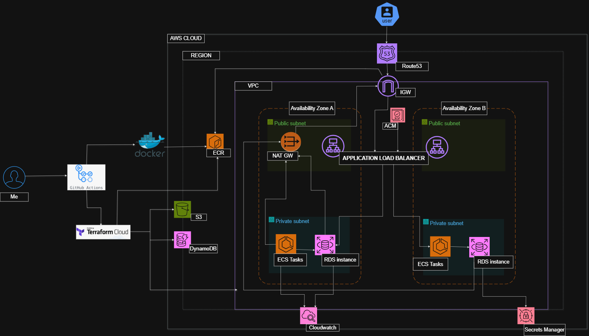
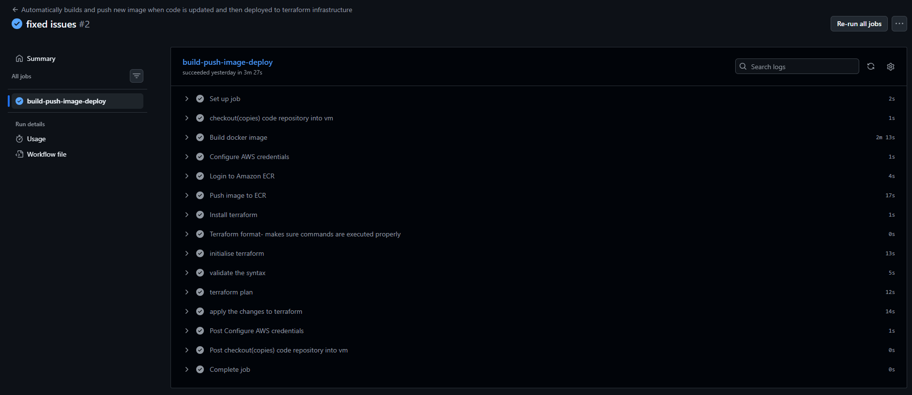

# Umami Analytics – AWS ECS Production Deployment

## TL;DR

**Production-grade deployment of Umami Analytics on AWS using ECS Fargate and Terraform.**

- Designed and deployed a **secure, highly available AWS architecture**
- Implemented **Infrastructure as Code** with modular Terraform
- Built **fully automated CI/CD pipelines** using GitHub Actions
- Secured traffic with **HTTPS, ACM, Route 53, and private subnets**
- Deployed a real, internet-facing application with zero manual AWS setup

**Tech:** AWS (ECS, ALB, RDS, VPC, IAM), Terraform, Docker, GitHub Actions, Route 53, ACM

## Table of Contents
- [Project Overview](#project-overview)
- [Architecture](#architecture)
- [Repository Structure](#repository-structure)
- [Infrastructure](#infrastructure)
- [Application](#application)
- [CI/CD Pipelines](#cicd-pipelines)
- [Deployment Workflow](#deployment-workflow)
- [How to Reproduce](#how-to-reproduce)
- [Challenges & Lessons Learned](#challenges--lessons-learned)

---

## Project Overview

This project delivers an **end-to-end, production-ready deployment** of the Umami open-source analytics platform on **AWS ECS Fargate** using **Terraform**.

The goal was to design, deploy, and automate a **cloud-native analytics platform** using AWS best practices for **security, availability, and maintainability**, including HTTPS, a custom domain, and fully automated CI/CD pipelines.

### Key Features

- Containerised deployment using **Docker** with multi-stage builds
- **AWS ECS Fargate** for serverless container execution
- **Public-facing Application Load Balancer (ALB)** with HTTPS
- **Custom domain** managed via Route 53 and ACM
- **Infrastructure as Code** using modular Terraform
- **Automated CI/CD pipelines** using GitHub Actions

---


### High-Level Architecture

- Client traffic is routed through a **public Application Load Balancer (ALB)** over HTTPS.
- The ALB forwards requests to **ECS tasks running Umami** in **private subnets**.
- ECS tasks access external services via a **NAT Gateway**.
- **Route 53** manages DNS records mapping the custom domain to the ALB.
- **ACM** provides and manages TLS certificates for encrypted traffic.
- All infrastructure is provisioned and managed using **Terraform**.

> <p align="center">
  
</p>

---

## Repository Structure

```text
.
├── .github/
│   └── workflows/
│       └── main.yaml          
│
├── infra/
│   ├── main.tf
│   ├── variables.tf
│   ├── outputs.tf
│   └── modules/
│       ├── acm/
│       ├── alb/
│       ├── cloudwatch/
│       ├── ecs/
│       ├── iam/
│       ├── rds/
│       ├── route53/
│       ├── secret-manager/
│       ├── sg/
│       └── vpc/
│
├── umami/
│   ├── Dockerfile
│   └── src/
│
├── .gitignore
└── README.md

```
.
├── .github/
│   └── workflows/
│       └── main.yaml
│
├── infra/
│   ├── main.tf
│   └── modules/
│       ├── acm/
│       │   ├── main.tf
│       │   ├── variables.tf
│       │   └── outputs.tf
│       │
│       ├── alb/
│       │   ├── main.tf
│       │   ├── variables.tf
│       │   └── outputs.tf
│       │
│       ├── cloudwatch/
│       │   ├── main.tf
│       │   ├── variables.tf
│       │   └── outputs.tf
│       │
│       ├── ecs/
│       │   ├── main.tf
│       │   ├── variables.tf
│       │   └── outputs.tf
│       │
│       ├── iam/
│       │   ├── main.tf
│       │   ├── variables.tf
│       │   └── outputs.tf
│       │
│       ├── rds/
│       │   ├── main.tf
│       │   ├── variables.tf
│       │   └── outputs.tf
│       │
│       ├── route53/
│       │   ├── main.tf
│       │   ├── variables.tf
│       │   └── outputs.tf
│       │
│       ├── secret-manager/
│       │   ├── main.tf
│       │   ├── variables.tf
│       │   └── outputs.tf
│       │
│       ├── sg/
│       │   ├── main.tf
│       │   ├── variables.tf
│       │   └── outputs.tf
│       │
│       └── vpc/
│           ├── main.tf
│           ├── variables.tf
│           └── outputs.tf
│
├── umami/
│   ├── Dockerfile
│   └── src/
│
├── .gitignore
└── README.md


## Infrastructure

All AWS infrastructure is provisioned using **Terraform** with a modular design.

### Key Infrastructure Components

- **VPC** with public and private subnets across multiple Availability Zones
- **NAT Gateway** for outbound internet access from private subnets
- **Application Load Balancer (ALB)** with HTTPS listeners
- **ECS Cluster, Services, and Task Definitions** (Fargate)
- **Amazon ECR** for container image storage
- **AWS Certificate Manager (ACM)** for SSL/TLS certificates
- **Route 53** for DNS management
- **Security Groups** for network access control
- **IAM Roles** for ECS task execution and service permissions
- **CloudWatch** for logging and monitoring
- **S3 + DynamoDB** for Terraform remote state and state locking

---

## Application

Umami is deployed as a **containerised application** using Docker.

- A **multi-stage Dockerfile** builds and packages the application efficiently
- Docker images are pushed to **Amazon ECR**
- **ECS task definitions** reference ECR images during deployment
- Environment configuration and secrets are managed securely using AWS services

---

## CI/CD Pipelines

CI/CD pipelines are implemented using **GitHub Actions**.

### Pipeline Responsibilities

#### Docker Build & Push

- Builds the Docker image
- Tags images for traceability
- Pushes images to **Amazon ECR**

#### Terraform Plan & Apply

- Initializes Terraform
- Plans and applies infrastructure changes
- Deploys ECS services and updates task definitions

---

## Deployment Workflow

### Docker Build and Push

- Builds the Umami Docker image
- Pushes the image to **Amazon ECR**

### Terraform Plan

- Runs `terraform init`
- Generates an execution plan using `terraform plan`
- Validates infrastructure changes

### Terraform Apply

- Provisions all AWS resources:
  - ECS Fargate service
  - Application Load Balancer
  - Route 53 records
  - ACM certificates
- Deploys the application behind HTTPS

### Terraform Destroy

- Safely removes all Terraform-managed resources
- Ensures clean teardown without orphaned infrastructure

---

## How to Reproduce

### Prerequisites

- AWS account
- Terraform
- Docker
- GitHub account
- Domain managed via Route 53 (or external DNS)

### Local Application Validation

```bash
npm install
npm run build
npm run start

Visit here to access application locally:
http://localhost:3000
```

### Terraform Deployment

```
cd infra
terraform init
terraform plan
terraform apply
```

## CI/CD Automation (GitHub Actions)

This project uses a fully automated GitHub Actions pipeline to build, package, and deploy the application to AWS ECS using Terraform.

<p align="center">
  
</p>

The pipeline performs the following on every push to `main`:

- Builds the Umami Docker image
- Pushes the image to Amazon ECR
- Runs Terraform (init, plan, apply)
- Updates the ECS Fargate service behind the Application Load Balancer


## Live URL

https://adnaan-application.com


## Challenges & Lessons Learned

- Managing ACM certificate validation with Route 53 in Terraform
- Debugging ALB health check failures during initial deployment


